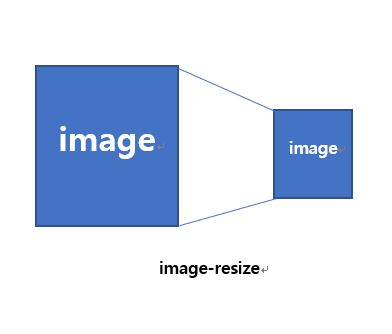
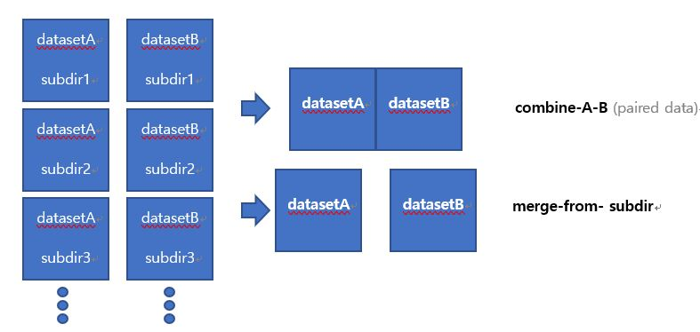

# GAN-utils

    
    

- [image-resize](./image-resize) : Change the resolution of all the images in the folder.
- [combine-A-B](./combine-A-B) : Combine dataset A and dataset B to create a pair image(include funciton about image-resize)
- [merge-from-subdir](./merge-from-subdir) : Combine the data sets A and B in the subdirectory(include funciton about image-resize)
